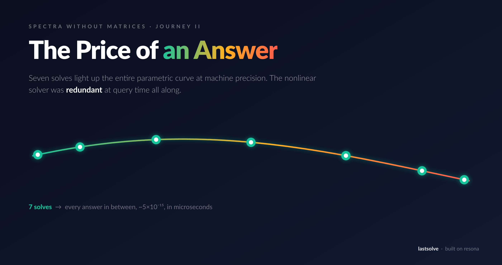
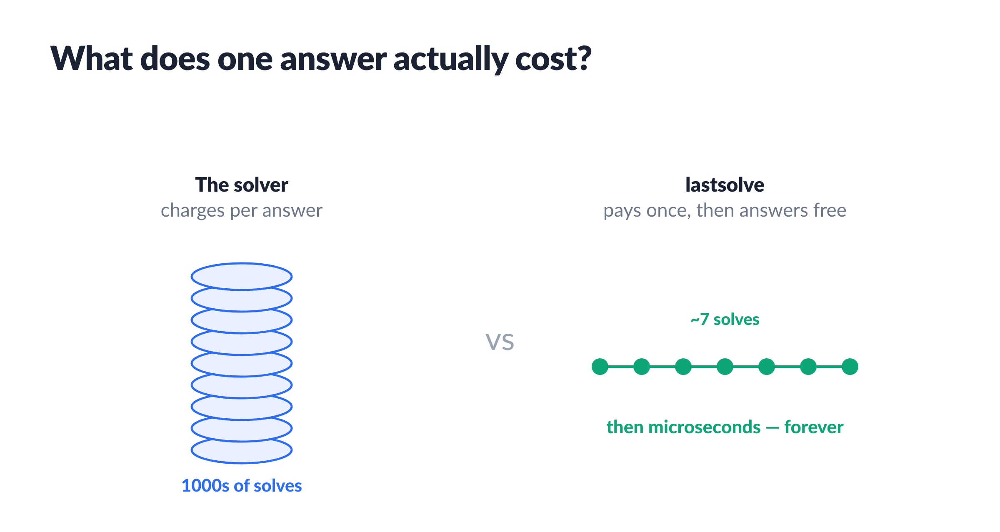
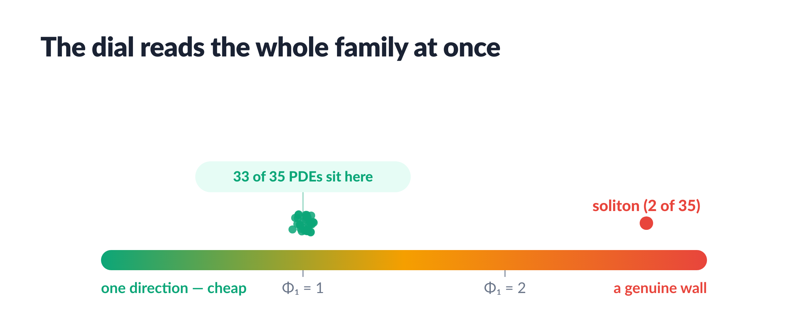
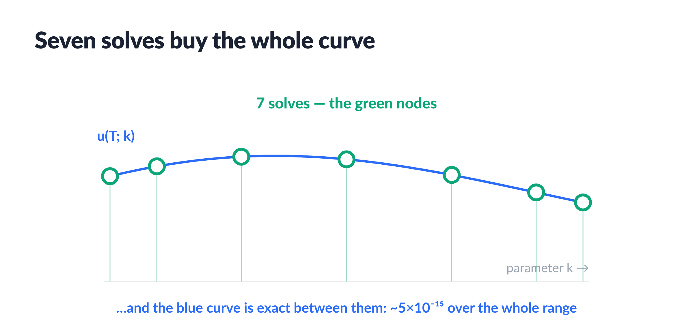
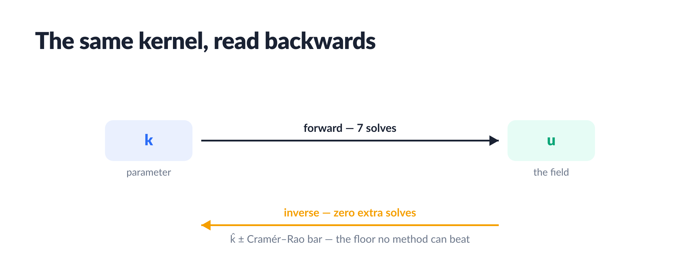
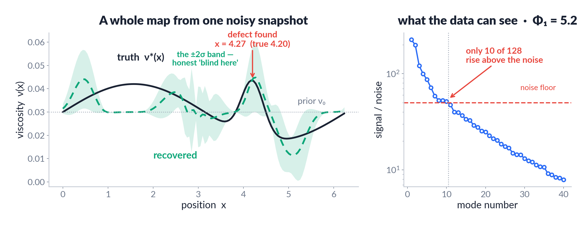
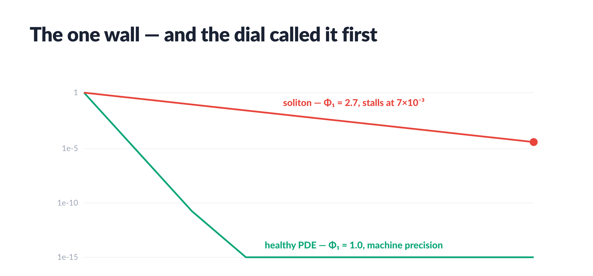

# The Price of an Answer



> *"Nonlinear means no shortcuts." That turned out to be a story we tell ourselves — and I have 35 receipts that say otherwise.*

## The problem: a meter that never stops running

If you have ever run a scientific simulation, you know the feeling. You have a solver — for fluid flow, for heat, for a chemical reaction, for a wave — and it is *slow*. One run takes seconds, minutes, sometimes hours on a cluster. That would be fine if you only ran it once. But you almost never run it once.

Real work asks the *same* solver the same kind of question over and over, with one knob changed each time. What does the flow look like at viscosity 0.031? At 0.032? At 0.033? That is a **parameter sweep** — hundreds of runs. Fitting your model to measured data is a **calibration loop** — hundreds of runs inside an optimizer. Estimating uncertainty is **Monte Carlo** — thousands of runs. Every one of those runs is a coin in the meter, and the meter never stops.

Why does everyone just keep paying? Because of one deeply held belief: the equations are **nonlinear**, and nonlinear is supposed to mean *no shortcuts* — you cannot cheat your way to the answer, you have to grind out every run. This article is about testing that belief on 35 of the most famous nonlinear equations in physics, and finding it mostly false. The meter, it turns out, was charging you for answers you already had.



## First, measure the structure

Here is the move, and it is the same one every time. Before you spend a single run trying to speed things up, you *measure how much structure the problem actually has* — and only then decide what to build.

The measuring instrument is a single number called the **effective rank**, written **Φ₁**. Forget the name for a second and picture what it counts. Take your solver and run it at a handful of different knob settings — a few values of that viscosity. Each run gives you a full field of numbers (a snapshot of the flow). Stack those snapshots up and ask: as I turn the knob, in how many genuinely *independent directions* does the answer move? If turning the knob just slides the answer along a single trend, that is **Φ₁ ≈ 1** — one direction, one degree of freedom hiding inside a nonlinear problem. If every run looks wildly unrelated to the last, Φ₁ is large — the problem is genuinely rich and there is no cheap description.

That is the whole diagnostic: **low Φ₁ means a cheap shortcut exists; high Φ₁ means it does not.** You measure first, you pay accordingly.



So I pointed Φ₁ at all 35 equations — Burgers, KdV, Kuramoto–Sivashinsky in full chaos, a bright soliton, Camassa–Holm, fractional heat, thirty more. For **33 of the 35** the reading came back **Φ₁ = 1.00**. Chaos included. One direction. The entire family of answers, across a ±30% swing of the parameter, is a single one-dimensional curve gently bending through a space of 128 dimensions.

Read that again, because it is the whole article: a *nonlinear* equation whose answers, as you turn the knob, trace out something as simple as a curved wire. And you do not need to re-solve a nonlinear PDE to walk along a wire. You need to find seven points on it — and connect the dots.

## Seven solves buy everything



The stand solves each equation at 7 Chebyshev points of the parameter range and builds a barycentric interpolant — a fifty-line construction from a numerical analysis textbook. That is the whole method. The price list it produces:

- **Forward answers:** 34 of 35 equations at relative error ~5·10⁻¹⁵ — machine precision — *across the entire parameter range*, not near an anchor. Queries take 8–14 microseconds: a median **576× faster** than the solver, and the ratio is honest — it includes nothing amortized, no GPU, no training.
- **Budget:** median 10 solves per equation (7 nodes + 3 held-out validation solves). The stand escalates only where the parametric curve is genuinely stiff — fractional heat, with the parameter in the *exponent* of the operator, needed 31 nodes. The stand reports every solve it spends.
- **Full disclosure:** we first built this kernel from Taylor sensitivities (W = ∂u/∂k — the tangent linear model), then tried to kill it with the strongest classical baseline we could think of. The baseline — Chebyshev interpolation on the same budget — won by five orders of magnitude. So we absorbed it. What you are reading is the method that beat our method.

## The same seven solves, read backwards



So far we have gone *forward*: pick a parameter, get the answer. But the question scientists usually actually care about runs the other way. You have measured data — a snapshot of a real flow, a real reaction — and you want to know *which parameter produced it*. Which viscosity does this fluid actually have? That is the **inverse problem**, and it is normally the hard, expensive one: people wrap the slow solver in an optimizer and run it hundreds of times, feeling their way toward the parameter that matches.

Here it is free. The wire we already found *is* the inverse solver: to find the parameter behind a measurement, you just slide along the curve to the point that matches your data. Hide a true parameter, hand me one noisy snapshot, and recovering it is a scan of the curve we built for nothing — **zero additional solves**.

- Clean data: **35 of 35** recovered below 10⁻¹⁰; several to the exact float64 bit.
- Noisy data: here is the strongest claim in the piece. There is a hard mathematical floor on how accurately *any* method can recover a parameter from noisy data — it is called the Cramér–Rao bound, and it is a theorem, not a benchmark. Our error lands right on it (a median of 0.7× the bound, exactly where a provably optimal estimator sits). Say it plainly: past this line, better methods do not exist. The error that remains is the noise's fault, not the algorithm's.
- The derivative of the interpolant is the Fisher information, so every estimate ships with an honest error bar — computed from the data itself. When a parameter is unidentifiable, the bar says so instead of the estimate lying.

## A whole map from one snapshot



Now the hardest version. Instead of hiding a single number, hide a whole *function* — a viscosity that varies from place to place, ν(x): a smooth background with a hidden bump, a "defect," somewhere in it. You get one noisy photograph of the flow and have to reconstruct the entire map. This is the setup behind seismic imaging, medical tomography, flaw detection — and it is brutal, because you are asking for 128 unknown values while your single snapshot plainly cannot pin down that many. Most of the map is simply not in the data.

Which is exactly why you measure first. The dial reads the situation before anyone reconstructs anything, and its verdict is blunt: of the 128 unknowns, only about **10 leave a strong enough fingerprint in the snapshot to be recoverable at all**. So the method reconstructs precisely those ten — and it nails the defect, placing it at x = 4.27 against a true 4.20. For everything else it does the honest thing: it draws a wide grey band that says *the data cannot see this*, instead of inventing detail. And the bands are trustworthy — 99.2% of the true map falls inside them. It refuses to hallucinate the invisible 70%.

Two lines from the stand deserve framing. Raise the noise to 5% and the visible count drops to **zero** — that snapshot knows nothing about the map, and the method says so out loud. Add a second snapshot and the count climbs to 12, the error falls — you can *buy* visibility with data, and the dial quotes the exchange rate.

This is the part that classical field inversion and neural reconstructions both get wrong by design: they always return a map, confident everywhere, half of it invented. Measuring what the data can see *before* reconstructing is the entire difference between an answer and a guess.

## The walls — and the dial saw them first



Now the honest part — because a method you can only trust when it works is not a method. One equation out of the 35 refused to fall. And the beautiful thing is that the dial *predicted* the refusal.

The bright NLS soliton is the one equation whose shortcut never appeared: we spent 63 points instead of 7 — 200 full solves — and the error crawled from 2·10⁻² only to 7·10⁻³, and stopped. Why? Because its answer, as you turn the knob, does *not* trace a simple wire. The soliton is a travelling pulse, and as the parameter changes the pulse moves and breathes — and a moving shape genuinely needs many independent directions to describe. This is not a failure of cleverness; it is a theorem (the Kolmogorov *n*-width barrier): no small set of fixed shapes can ever add up to a moving one. The remarkable part is that Φ₁ *told us this in advance*: it read **2.70** for the soliton — the one reading far from 1.00 in the whole set — before we had spent the wasted 200 solves. That is the entire value of measuring first: the instrument warns you off the wall instead of letting you run into it. (And even here there is a consolation: recover the parameter through the pulse's *amplitude* rather than its position, and the inversion is exact to the last bit — the one observable that stays still.)

One more thing deserves to be said out loud, because it turns the title from a slogan into a theorem's shadow. A century ago Carleman showed that any polynomial nonlinearity becomes *linear* in a lifted basis of monomials — exactly linear, no approximation, just more coordinates (resona ships the construction: `resona.lift.carleman`). Every rank-1 parametric response in the table above is the visible edge of such a lift: a finite chart in which the nonlinear family straightens out. The soliton is the one case whose chart refuses to stay finite — and that refusal *is* the Kolmogorov n-width wall the dial flagged. That is, in the end, all Φ₁ ever measures: the size of the linear chart a problem would need — and, therefore, the true price of an answer.

Scope, stated plainly: the kernel is built per configuration — though the configuration itself can be lifted into parameters (expand the initial condition in a small basis and one precompute covers the whole family, because the effective rank stays low even in the enlarged space); the test horizons are short; the noiseless inverse targets were generated by the same discretization (no model error); the components — Chebyshev interpolation, sensitivity analysis, maximum likelihood — are all classical. We did not invent new mathematics. We measured where the expensive machine is redundant, and it turned out to be almost everywhere we looked.

And the neural-operator elephant: the same parametric task is a standard benchmark for operator-learning papers, which typically spend thousands of training solves to reach 10⁻²–10⁻³. Our stand spends ten solves and reaches 10⁻¹⁴, plus error bars, plus a diagnosis. We leave that duel for the reader to run — the stands print every number.

## So — what does an answer cost?

Not what the solver charges. The honest price of an answer is set by the structure of the question: Φ₁ ≈ 1 and machine precision costs seven solves and a microsecond; Φ₁ = 2.7 and you have met a genuine wall; Φ₁ of your *data* is 10, and no method on earth will extract an eleventh number from them. Measure first. Then pay.

Which leaves the punchline, and it is worth the whole trip. We spend enormous effort — clusters, GPU months, careers — building bigger machines to grind through nonlinear problems, on the assumption that nonlinear means expensive. But within the range your questions actually live in, almost every famous nonlinear equation turned out to hide a wire so simple that seven points describe it exactly. The equations are nonlinear. The *answers you were paying for* were, quietly, — *never nonlinear at all*.

## Run it yourself

Everything — this essay, all three stands, and the figures — lives in one repository: **[github.com/dimaq12/the-price-of-an-answer](https://github.com/dimaq12/the-price-of-an-answer)**.

```
git clone https://github.com/dimaq12/the-price-of-an-answer.git
cd the-price-of-an-answer
pip install -r requirements.txt
python stands/seven_solves.py       # the full price list over 35 PDEs
python stands/crb_optimal.py        # Cramér–Rao-optimal inversion, error bars included
python stands/one_snapshot_map.py   # the map from one snapshot, blind zones measured
```

Every number above is printed by a stand, checked against a hidden truth. And the machinery is now a library: **pip install lastsolve** — the accelerator, the dial, the certificates and the honest refusals, packaged ([github.com/dimaq12/lastsolve](https://github.com/dimaq12/lastsolve)). Don't trust me — run it.

---
*Part of the "Spectra Without Matrices" series. Author: Dmytro Sierikov.*
